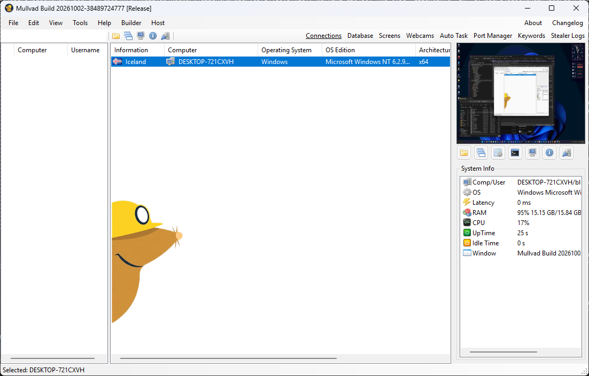
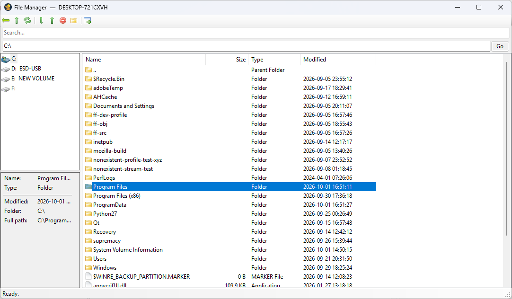
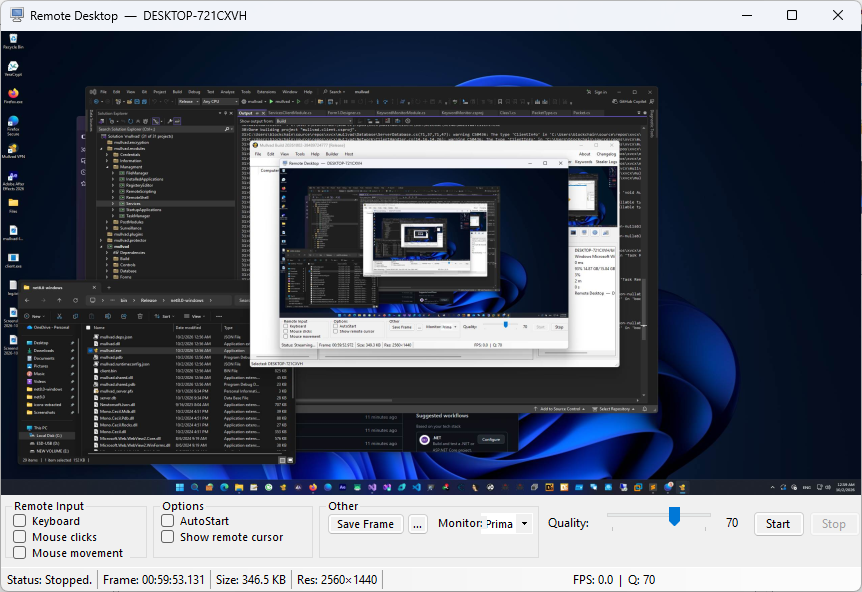

# Mullvad RAT
> *by larpexe*

A modular Windows remote access framework built on .NET 8 (server) and .NET 4.7.2 (client modules). Encrypted module delivery, VPS relay support, and a full WinForms operator console.

---

## Screenshots







---

## Features

**Core**
- Encrypted, chunked module delivery to the client at runtime
- TLS-encrypted C2 channel with self-signed certificate
- VPS host/relay mode — operators connect remotely, clients never expose a port
- Multi-client operator console with live handshake data (OS, username, country, version)
- Builder for generating and configuring client stubs

**Modules**
| Module | Description |
|---|---|
| File Manager | Full remote file browser — upload, download, delete, new folder, open in terminal |
| Remote Shell | Interactive CMD / PowerShell session on the remote machine |
| Task Manager | Live process tree with kill, details, threads, modules |
| Services | Windows Services manager — start, stop, restart, full properties |
| Registry Editor | Remote registry browser and editor |
| Startup Applications | View and manage startup entries |
| Remote Desktop | Live screen capture (standard + H.265) |
| Hidden Desktop (HVNC) | Isolated hidden desktop session |
| Remote Scripting | Execute scripts on the client |
| Keylogger | Low-level keyboard hook logger |
| Clipboard Manager | Read and monitor remote clipboard |
| Remote Webcam | Live webcam feed |
| Remote Microphone | Live microphone capture and send |
| Remote Desktop Audio | Capture system audio |
| Browser Inspection | Inspect browser data, open paths in remote Explorer |
| Geo-Location | IP and GPS location data |
| GPS Exploit | Extended location exploitation |
| System Information | Full system hardware and OS report |
| Advanced System Info | Deep hardware enumeration |
| Network Information | Adapters, routes, DNS, ARP |
| TCP Connections | Active connection table |
| Installed Applications | Software inventory |
| Migrate Process | Process migration / injection |
| Discord | Discord-related data |
| Keyword Monitor | Monitor clipboard / input for keywords |

---

## Architecture

```
mullvad.sln
├── mullvad/            # Operator console (net8.0-windows WinForms)
├── mullvad.Client/     # Client stub (net8.0-windows)
├── mullvad.Shared/     # Shared protocol (Packet, PacketType)
├── Mullvad.Protector.* # Binary protection layer
└── <Module>/           # net472 DLL modules — loaded and delivered at runtime
```

The client loads no modules at startup. The operator delivers them on demand as encrypted `.enc` blobs over the existing TLS channel. Each module implements a single `Execute(string action, string payload) → string` entry point.

---

## Build

**Requirements**
- Visual Studio 2022 (or later)
- .NET 8 SDK
- .NET Framework 4.7.2 targeting pack

**Steps**

1. Open `mullvad.sln` in Visual Studio
2. Build the solution — module projects copy their DLLs to `mullvad/bin/<config>/net8.0-windows/Modules/` automatically via post-build targets
3. Run `mullvad` (the operator console)
4. Use the Builder to generate a client stub

> Build modules before the server so the `Modules/` folder is populated on first run.

---

## VPS Mode

The operator console can run in two modes:

- **Direct** — clients connect straight to the operator's machine
- **VPS Host** — a headless relay process listens for clients; operators connect to it remotely over TLS with a shared password

Configure via `Settings → VPS` in the operator console.

---

## License

Private — all rights reserved.
